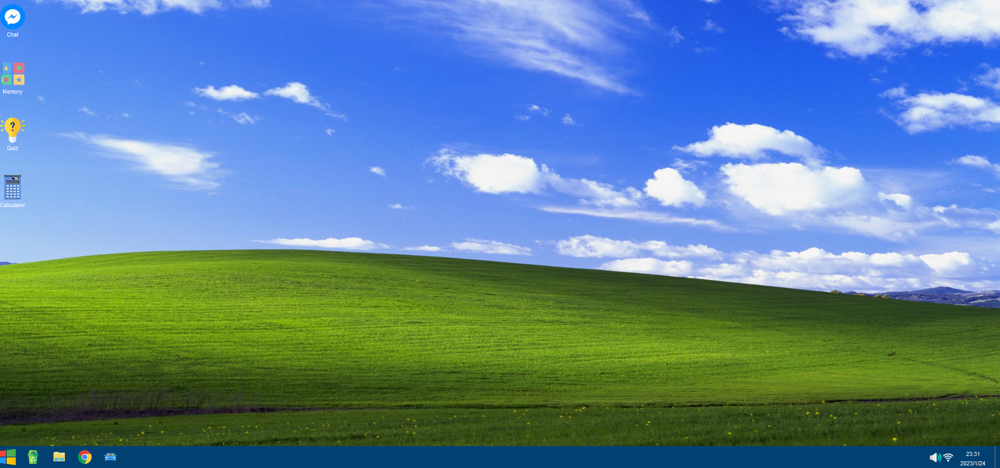

# Single Page Application

## Author: Fabian Dacic

### Introduction
Hello and welcome to the my SPA.
Now to download the application, it is actually quite easy. 
Either download it straight off this website or clone it by using the following commands in Git Bash:
git clone https://github.com/FabianDacic/Single-Page-Application.git

After downloading or cloning the repository to your machine, simply open the application with an IDE of your choice and then run the following command in the terminal:
npm run serve
After having run said command in the terminal, click on the link shown on it and the application should begin. The application itself has many icons although only 4 or technically said only 3 actually work: Chat, Memory and Calculator as Quiz is still a work in progress. In order to start them simply click on them.

In order to run the linters that were provided alongside the basis of the application, simply run the following command on the terminal while the current workign directory is set to the quiz's repository:
npm run lint

After having run the command above, the linter errors will be presented in case there are any. There also linter extensions for various IDEs (Visual Studio Code) that provide somewhat similar functions.
